<div align="center">


# AetherContracts

### Formally Verified AI × Blockchain for the Creator Economy

**23 Lean 4 Theorems** · **818 Lines of Proof** · **Zero `sorry` Gaps** · **6 Adversarial Audits (2× CLEAN)**

[](https://www.rust-lang.org/)
[](https://python.org)
[](https://developer.nvidia.com/cuda-toolkit)
[](https://nextjs.org)
[](https://solana.com)
[](https://ipfs.tech)
[](LICENSE)
[](https://github.com/teerthsharma)

</div>

---

> **This is not another influencer platform stitched together from heuristic ML and unaudited Solidity.**
>
> AetherContracts is a **formally verified** system where every algorithm has been mathematically proven correct in the Lean 4 theorem prover, transpiled through a certified artifact pipeline into memory-safe Rust, and deployed as exploit-immune WebAssembly smart contracts. The AI authenticity engine carries **mathematical guarantees** on its false-positive rate. The dynamic pricing engine is **provably stable** via Lyapunov descent. The engagement pod detector uses **persistent homology** to find topological fraud signatures that NLP classifiers cannot see.
>
> If your influencer analytics platform can be fooled by a bot farm, or your smart contract can be drained by a reentrancy attack — you are not operating at the level this market requires.
>
> **We are.**

---

## The Problem

The creator economy is a **$250B+ market** built on lies:

| Crisis | Impact | Industry Response |
|---|---|---|
| **Bot Networks & Purchased Followers** | 15-30% of influencer audiences are artificial | Probabilistic ML classifiers with uncontrolled false-positive rates |
| **Engagement Pods** | Coordinated human rings simulate virality — invisible to NLP | Nothing. Most platforms cannot detect human-operated pods |
| **Opaque Pricing** | Rates are arbitrary, rewarding fraud over authenticity | Simple averages that lag behind real-time data |
| **Contract Fraud** | Payment disputes, delayed releases, breached deliverables | Manual escrow with no enforcement |
| **Smart Contract Exploits** | $3.8B lost to DeFi hacks (2022 alone) | Heuristic audits that miss edge cases |

**Every existing solution is probabilistic. Ours is proven.**

---

## The Solution — Three Pillars

```
┌──────────────────────────────────────────────────────────────────────────┐
│                        AetherContracts Platform                         │
├──────────────────────────────────────────────────────────────────────────┤
│                                                                          │
│   ┌────────────────────┐  ┌──────────────────┐  ┌───────────────────┐   │
│   │  AETHER CORE       │  │  EPSILON ENGINE   │  │  QUANTUM VAULT    │   │
│   │  Mathematical      │  │  Multi-Tier AI    │  │  Verified Smart   │   │
│   │  Runtime            │  │  Inference        │  │  Contracts        │   │
│   │                    │  │                  │  │                   │   │
│   │  • Cauchy-Schwarz  │  │  • 1.5B Fast     │  │  • Escrow FSM     │   │
│   │  • Lyapunov PD     │  │  • 7B Balanced   │  │  • Oracle Bridge  │   │
│   │  • Chebyshev GC    │  │  • 33B Deep      │  │  • Milestone      │   │
│   │  • Betti Bounds    │  │  • Aether Link   │  │  • CAB Registry   │   │
│   │                    │  │  • Clara Oracle   │  │  • IPFS Dual-Layer│   │
│   └────────────────────┘  └──────────────────┘  └───────────────────┘   │
│           ▲                       ▲                       ▲              │
│           └───────────────────────┴───────────────────────┘              │
│                    Lean 4 → CAB Pipeline → Safe Rust → Wasm             │
└──────────────────────────────────────────────────────────────────────────┘
```

---

## Unified System Architecture

> Every box below is real, implemented code — not a slide deck. The mathematical cores are Lean 4 verified. The AI engine is battle-tested from the Epsilon IDE. The smart contracts inherit correctness from the proof chain.

```mermaid
graph TB
    %% ═══════════════════════════════════════════════════════════════
    %% LAYER 0: USER-FACING FRONTEND
    %% ═══════════════════════════════════════════════════════════════
    subgraph DASHBOARD["🖥️ Next.js 15 Dashboard"]
        direction LR
        BP["Brand Portal<br/>Creator Discovery<br/>Campaign Wizard<br/>Escrow Tracker"]
        CP["Creator Portal<br/>Score Breakdown<br/>Price History<br/>Milestone Tracker"]
        VP["Verification Portal<br/>CAB Certificate Explorer<br/>IPFS Proof Browser<br/>Score Auditor"]
    end

    %% ═══════════════════════════════════════════════════════════════
    %% LAYER 1: API GATEWAY
    %% ═══════════════════════════════════════════════════════════════
    subgraph API["⚡ Rust Axum API Gateway"]
        direction LR
        REST["REST Endpoints<br/>/audit /score /price<br/>/campaign /milestone"]
        WS["WebSocket Stream<br/>Real-time Audit<br/>Progress Updates"]
        IPFS_PROXY["IPFS Proxy<br/>Pin & Retrieve<br/>Proof Documents"]
    end

    %% ═══════════════════════════════════════════════════════════════
    %% LAYER 2: AETHER CORE — VERIFIED MATHEMATICAL RUNTIME
    %% ═══════════════════════════════════════════════════════════════
    subgraph AETHER_CORE["🔬 AETHER CORE — Lean 4 Verified Mathematical Runtime"]
        direction TB

        subgraph TOPOLOGY["Betti Approximation Bounds<br/>topology.rs + manifold.rs"]
            BETTI_0["β₀ Connected Components<br/>compute_betti_0()"]
            BETTI_1["β₁ Loop Detection<br/>estimate_betti_1()"]
            RIPS["Vietoris-Rips Complex<br/>SparseAttentionGraph"]
            EMBED["Time-Delay Embedding<br/>Takens Theorem<br/>TimeDelayEmbedder"]
            GEODESIC["Geodesic Partitioning<br/>BFS Cluster Centroid"]
            BETTI_0 --> RIPS
            BETTI_1 --> RIPS
            EMBED --> RIPS
            RIPS --> GEODESIC
        end

        subgraph CAUCHY["Cauchy-Schwarz Block Pruning<br/>aether.rs"]
            BLOCK_META["BlockMetadata<br/>centroid, radius<br/>variance, concentration"]
            UPPER_BOUND["Upper Bound Score<br/>‖q‖·(‖μ‖ + r)"]
            HBLOCK["HierarchicalBlockTree<br/>Level 0: 64-token<br/>Level 1: 256-token<br/>Level 2: 1024-token"]
            DRIFT["DriftDetector<br/>Centroid Trajectory<br/>Velocity Tracking"]
            COMPRESS["Geometric Compression<br/>CentroidDelta / Int4 / Full"]
            BLOCK_META --> UPPER_BOUND
            UPPER_BOUND --> HBLOCK
            BLOCK_META --> DRIFT
            BLOCK_META --> COMPRESS
        end

        subgraph LYAPUNOV["Lyapunov-Stable PD Governor<br/>governor.rs"]
            PD_CTRL["PD Controller<br/>ε(t+1) = ε(t) + α·e + β·de/dt"]
            ERROR_SIG["Error Signal<br/>e(t) = R_target − Δ/ε"]
            CLAMP["Safety Clamps<br/>ε ∈ [0.001, 10.0]"]
            TRIGGER["Threshold Trigger<br/>should_trigger(Δ)"]
            ERROR_SIG --> PD_CTRL
            PD_CTRL --> CLAMP
            CLAMP --> TRIGGER
        end

        subgraph CHEBYSHEV["Chebyshev GC Guards<br/>memory.rs"]
            MANIFOLD_HEAP["ManifoldHeap<br/>SpatialBlock(8-slot)<br/>SpatialNode Tree"]
            GC_HANDLE["Gc Handle<br/>Index + Generation"]
            CHEBY_GUARD["ChebyshevGuard<br/>mean, std_dev, k<br/>FPR ≤ 1/k²"]
            ENTROPY_REG["Entropy Regulation<br/>regulate_entropy()<br/>Mark-Sweep-Prune"]
            LIVENESS["Liveness Scoring<br/>Heat on access<br/>Decay 0.95x/cycle"]
            MANIFOLD_HEAP --> GC_HANDLE
            MANIFOLD_HEAP --> CHEBY_GUARD
            CHEBY_GUARD --> ENTROPY_REG
            MANIFOLD_HEAP --> LIVENESS
        end

        subgraph STATE_MOD["System State Vector<br/>state.rs"]
            STATE_VEC["μ(t) ∈ ℝ^d<br/>Deviation Metric<br/>L2 / L∞ / L1 norms"]
        end

        subgraph ML_ENGINE["ML Engine<br/>ml/"]
            REGRESSOR["ManifoldRegressor<br/>Linear → Poly → RBF<br/>→ GP → Geodesic"]
            CONVERGENCE["ConvergenceDetector<br/>Betti + Drift + Error"]
            AUTOGRAD["Autograd Engine<br/>Tensor + Backprop"]
            NEURAL["Neural Networks<br/>DenseLayer + MLP"]
            CLASSIFY["Classification<br/>SVM + KNN + Naive Bayes"]
            CLUSTER["Clustering<br/>K-Means + DBSCAN"]
            REGRESSOR --> CONVERGENCE
            AUTOGRAD --> NEURAL
        end

        subgraph LANG_IR["AETHER Declarative IR<br/>aether-lang/"]
            LEXER["Lexer<br/>manifold, block, regress<br/>embed, until, escalate"]
            PARSER["Parser<br/>Recursive Descent<br/>AST Generation"]
            INTERP["Interpreter<br/>Tree-Walking Execution"]
            LEXER --> PARSER --> INTERP
        end

        subgraph KERNEL["Bare-Metal Microkernel<br/>aether-kernel/"]
            SCHED["SparseScheduler<br/>Event-Driven<br/>Δ ≥ ε Wake Condition"]
            ALLOC["Bump Allocator<br/>no_std Heap"]
            IRQ["Interrupt Handlers<br/>IDT + PIC"]
            ELF_LOAD["Topological Loader<br/>Binary Shape Verification"]
            SERIAL["Serial I/O<br/>COM1 Debug Output"]
            SCHED --> ALLOC
            IRQ --> SCHED
            ELF_LOAD --> SCHED
        end
    end

    %% ═══════════════════════════════════════════════════════════════
    %% LAYER 3: EPSILON ENGINE — MULTI-TIER AI INFERENCE
    %% ═══════════════════════════════════════════════════════════════
    subgraph EPSILON["🧠 AETHER EPSILON ENGINE — Multi-Tier Local AI"]
        direction TB

        subgraph ROUTING["Complexity Router<br/>tiers/router.py"]
            SCORE_REQ["Score Request 1-10"]
            ROUTE_FAST["Score 0-2 → FAST"]
            ROUTE_BAL["Score 3-6 → BALANCED"]
            ROUTE_DEEP["Score 7-10 → DEEP"]
            SCORE_REQ --> ROUTE_FAST
            SCORE_REQ --> ROUTE_BAL
            SCORE_REQ --> ROUTE_DEEP
        end

        subgraph TIER1["Tier 1: The Foreman<br/>TinyLlama 1.1B / 1.5B"]
            T1_MODEL["CPU Always-On<br/>~1GB RAM"]
            T1_ROLE["Quick Sentiment<br/>Spam Detection<br/>Comment Classify"]
        end

        subgraph TIER2["Tier 2: The Logic-Gate<br/>Qwen2.5-Coder 7B"]
            T2_MODEL["GPU Resident<br/>~4GB VRAM"]
            T2_ROLE["Semantic Analysis<br/>AI-Text Detection<br/>Ghost Text Stream"]
            T2_KV["INT8 KV Cache<br/>Sparse Top-64<br/>~80MB"]
        end

        subgraph TIER3["Tier 3: The Architect<br/>DeepSeek 33B/70B"]
            T3_MODEL["SSD → RAM → VRAM<br/>Layer-by-Layer Swap<br/>AirLLM Sharding"]
            T3_ROLE["Full Content Audit<br/>Cross-Platform Analysis<br/>Advanced GenAI Detection"]
        end

        subgraph AETHER_LINK["Aether Link Orchestrator<br/>aether/link.py"]
            EVENT_BUS["Async Event Bus<br/>asyncio Queues"]
            DUAL_STREAM["Dual-Stream Mux<br/>Fast WebSocket<br/>+ Delayed Verify"]
            HOT_SWAP["Hot-Swap Protocol<br/>7B streams, 70B verifies<br/>Rollback on error"]
        end

        subgraph CLARA["Clara Context Oracle<br/>clara/oracle.py"]
            SQLITE_VEC["sqlite-vec<br/>Vector Similarity"]
            TREESITTER["Tree-sitter AST<br/>C-Binding Parser"]
            TFIDF["TF-IDF Search<br/>Code + Content Index"]
        end

        subgraph VRAM_GUARD["VRAMGuard<br/>C++ Hardware Fencing"]
            CUDA_SEM["CUDA Semaphores<br/>fence_vram()<br/>release_vram()"]
            HUGE_PAGES["HugePages Alloc<br/>SEC_LARGE_PAGES<br/>TLB Optimization"]
            NVME_DMA["NVMe Direct-to-VRAM<br/>IoCompletionPorts<br/>Bypass CPU Copy"]
            PERPLEXITY["Perplexity Rollback<br/>Shannon Entropy Guard<br/>1.8x spike → Recompute"]
        end

        subgraph TOKEN_PUMP["0-Copy Token Pump"]
            NAMED_PIPE["Windows Named Pipe<br/>\\\\.\\pipe\\sealmega"]
            ZERO_COPY["Zero-Copy IPC<br/>POSIX shared_memory<br/>mmap C-structs"]
        end

        ROUTE_FAST --> T1_MODEL
        ROUTE_BAL --> T2_MODEL
        ROUTE_DEEP --> T3_MODEL
        AETHER_LINK --> EVENT_BUS
        EVENT_BUS --> DUAL_STREAM
        DUAL_STREAM --> HOT_SWAP
        T2_MODEL --> T2_KV
        T3_MODEL --> VRAM_GUARD
        CUDA_SEM --> HUGE_PAGES
        CLARA --> SQLITE_VEC
        CLARA --> TREESITTER
    end

    %% ═══════════════════════════════════════════════════════════════
    %% LAYER 4: QUANTUM VAULT — FORMALLY VERIFIED BLOCKCHAIN
    %% ═══════════════════════════════════════════════════════════════
    subgraph VAULT["🔐 AETHER QUANTUM VAULT — Formally Verified Blockchain"]
        direction TB

        subgraph CAB["CAB Pipeline<br/>Certified Artifact Builder"]
            LEAN4["Lean 4 Proofs<br/>23 Theorems<br/>818 Lines<br/>0 sorry gaps"]
            LAMBDA_IR["LambdaIR<br/>+ Crypto Certificate"]
            MINI_C["MiniC<br/>+ Semantic Hash"]
            VERIFIED_C["Verified C<br/>+ Preservation Proof"]
            SAFE_RUST["Safe Rust<br/>0 unsafe blocks<br/>Ownership Verified"]
            WASM_BIN["WebAssembly<br/>On-Chain Binary"]
            LEAN4 --> LAMBDA_IR --> MINI_C --> VERIFIED_C --> SAFE_RUST --> WASM_BIN
        end

        subgraph ESCROW["Campaign Escrow Program"]
            ESC_FSM["State Machine<br/>CREATED → FUNDED<br/>→ ACTIVE → COMPLETED<br/>→ SETTLED"]
            ESC_CANCEL["Cancel / Refund<br/>Timeout Auto-Refund"]
            ESC_DISPUTE["Dispute Resolution<br/>Freeze → Arbitrate"]
            INV_TABLE["6 Proven Invariants<br/>No premature release<br/>No double spend<br/>Total conservation<br/>Auth enforcement<br/>Timeout guarantee<br/>Auth-only transitions"]
        end

        subgraph ORACLE["Authenticity Oracle Program"]
            ORACLE_ATT["Attestation Protocol<br/>Score + Bounds + CID"]
            ORACLE_MULTI["Multisig 2-of-3<br/>Platform + Auditor"]
            ORACLE_VERIFY["CAB Hash Verify<br/>Proof Chain Validation"]
        end

        subgraph MILESTONE["Milestone Verifier Program"]
            MILE_CHECK["Deliverable Check<br/>Engagement Targets<br/>Post Publication<br/>Timeline Compliance"]
            MILE_RELEASE["Conditional Release<br/>oracle_verified AND<br/>brand_approved AND<br/>score ≥ threshold AND<br/>time ≤ deadline AND<br/>NOT already_paid"]
        end

        subgraph CAB_REG["CAB Certificate Registry"]
            REG_HASHES["On-Chain Hashes<br/>lean4 → lambdaIR<br/>→ miniC → C → Rust<br/>→ Wasm"]
            REG_AUDIT["Audit Round Status<br/>6 rounds recorded<br/>Last 2 = CLEAN"]
        end

        subgraph DUAL_STORE["Dual-Layer Storage"]
            ON_CHAIN["On-Chain — Solana<br/>Escrow state, balances<br/>Scores, attestations<br/>Milestone flags"]
            IPFS_STORE["IPFS — Content Addressed<br/>Full audit reports<br/>Betti topology graphs<br/>CAB proof certificates<br/>Campaign terms docs<br/>NLP analysis results"]
            ON_CHAIN --- IPFS_STORE
        end
    end

    %% ═══════════════════════════════════════════════════════════════
    %% LAYER 5: CREATOR ECONOMY APPLICATION LAYER
    %% ═══════════════════════════════════════════════════════════════
    subgraph CREATOR_APP["🎯 Creator Economy Scoring Engine — aether-contracts/"]
        direction LR
        AUTH_ENGINE["Authenticity Engine<br/>Weighted Scoring<br/>Score = w₁·pod + w₂·bot<br/>+ w₃·content"]
        POD_DET["Pod Detector<br/>β₁ spike = pod ring<br/>Dual-layer audit"]
        BOT_FILT["Bot Filter<br/>Chebyshev k-bound<br/>FPR ≤ 1/k²"]
        PRICE_ENG["Pricing Engine<br/>Lyapunov convergence<br/>Error contraction"]
        ATTN_ACC["NLP Accelerator<br/>Cauchy-Schwarz pruning<br/>Zero-false-negative"]
    end

    %% ═══════════════════════════════════════════════════════════════
    %% LAYER 6: DATA PIPELINE
    %% ═══════════════════════════════════════════════════════════════
    subgraph PIPELINE["📡 Data Pipeline"]
        direction LR
        SOCIAL_API["Social API Adapters<br/>Instagram / TikTok<br/>YouTube / X"]
        SYNTH["Synthetic Generator<br/>Organic / Pod / Bot<br/>Mixed Profiles"]
        GRAPH_BUILD["Graph Builder<br/>Raw Data → ManifoldPoints<br/>→ SparseAttentionGraph"]
    end

    %% ═══════════════════════════════════════════════════════════════
    %% CONNECTIONS — THE UNIFIED DATAFLOW
    %% ═══════════════════════════════════════════════════════════════
    BP & CP & VP --> REST & WS
    REST --> AUTH_ENGINE
    AUTH_ENGINE --> POD_DET & BOT_FILT & ATTN_ACC
    POD_DET --> BETTI_1
    POD_DET --> RIPS
    POD_DET --> EMBED
    BOT_FILT --> CHEBY_GUARD
    BOT_FILT --> MANIFOLD_HEAP
    PRICE_ENG --> PD_CTRL
    PRICE_ENG --> ERROR_SIG
    ATTN_ACC --> UPPER_BOUND
    ATTN_ACC --> HBLOCK
    ATTN_ACC --> SCORE_REQ
    T1_ROLE --> AUTH_ENGINE
    T2_ROLE --> AUTH_ENGINE
    T3_ROLE --> AUTH_ENGINE
    AUTH_ENGINE --> ORACLE_ATT
    ORACLE_ATT --> ESC_FSM
    PRICE_ENG --> REST
    ESC_FSM --> MILE_CHECK
    MILE_CHECK --> MILE_RELEASE
    MILE_RELEASE --> ON_CHAIN
    WASM_BIN --> ESC_FSM
    WASM_BIN --> ORACLE
    LEAN4 --> REG_HASHES
    IPFS_PROXY --> IPFS_STORE
    SOCIAL_API --> GRAPH_BUILD
    SYNTH --> GRAPH_BUILD
    GRAPH_BUILD --> POD_DET
    GRAPH_BUILD --> BOT_FILT
    CONVERGENCE --> AUTH_ENGINE
    STATE_VEC --> SCHED
    TRIGGER --> SCHED
```



---

## The Four Verified Mathematical Cores

Every core is **proven in Lean 4**, transpiled through the **CAB pipeline**, and compiled to **Safe Rust** with zero `unsafe` blocks.

### 🔷 Cauchy-Schwarz Block Pruning — `aether.rs`

**Purpose in Creator Economy**: Real-time semantic analysis of millions of comments without quadratic cost.

```
Standard Transformer Attention: O(n²) — UNFEASIBLE for real-time dashboards
AETHER Block Pruning:           O(log n) — via hierarchical upper-bound skipping

For query q and block with centroid μ and radius r:
  score(q, block) ≤ ‖q‖ · (‖μ‖ + r)    ← Cauchy-Schwarz Inequality

If upper_bound < threshold → SKIP entire block
GUARANTEE: Zero false negatives. Every relevant token is preserved.
```

### 💚 Lyapunov-Stable PD Governor — `governor.rs`

**Purpose in Creator Economy**: Dynamic pricing that converges smoothly — no oscillation, no runaway.

```
Error Signal:  e(t) = optimal_rate − current_rate
Control Law:   ε(t+1) = ε(t) + α·e(t) + β·de/dt
Safety Clamp:  ε ∈ [0.001, 10.0]

GUARANTEE: |error(t+1)| ≤ |error(t)| — Monotonic Lyapunov Descent
           Prices converge. Oscillation is mathematically impossible.
```

### 🟡 Chebyshev GC Guards — `memory.rs`

**Purpose in Creator Economy**: Bot detection that NEVER unfairly penalizes legitimate viral growth.

```
Chebyshev's Inequality (distribution-agnostic):
  P(|X − μ| ≥ kσ) ≤ 1/k²

Set k=2 → FPR ≤ 25%    |  Set k=3 → FPR ≤ 11.1%
Set k=4 → FPR ≤ 6.25%  |  Set k=5 → FPR ≤ 4%

GUARANTEE: Works on ANY distribution. Power-law, Pareto, heavy-tailed — doesn't matter.
           The false positive rate is mathematically bounded regardless.
```

### 🔴 Betti Approximation Bounds — `topology.rs` + `manifold.rs`

**Purpose in Creator Economy**: Detecting engagement pods by their topological shape — invisible to NLP.

```
Social Graph → Vietoris-Rips Complex → Persistent Homology

β₀ = connected components (audience segments)
β₁ = 1-dimensional loops (ENGAGEMENT PODS)

Pod = dense reciprocal ring → spike in β₁
Organic = branching tree → low β₁

GUARANTEE: β₁_heuristic ≤ β₁_exact + window_overlap (bounded overcount)
```

---

## The CAB Pipeline — From Proof to Production

```
╔══════════════════════════════════════════════════════════════════════════╗
║                    Certified Artifact Builder (CAB)                     ║
╠══════════════════════════════════════════════════════════════════════════╣
║                                                                         ║
║   ┌─────────────┐    ┌───────────┐    ┌─────────┐    ┌──────────────┐  ║
║   │  LEAN 4     │───▶│ LambdaIR  │───▶│  MiniC  │───▶│ Verified C   │  ║
║   │  23 theorems│    │ + crypto  │    │ + hash  │    │ + semantic   │  ║
║   │  818 lines  │    │ certificate│   │         │    │ preservation │  ║
║   │  0 sorry    │    │           │    │         │    │ proof        │  ║
║   └─────────────┘    └───────────┘    └─────────┘    └──────┬───────┘  ║
║                                                              │          ║
║   ┌─────────────────────────────────────────────────────────▼────────┐  ║
║   │                                                                   │  ║
║   │   ┌──────────────┐         ┌──────────────────┐                  │  ║
║   │   │  Safe Rust   │────────▶│  WebAssembly     │                  │  ║
║   │   │  0 unsafe    │         │  On-Chain Deploy  │                  │  ║
║   │   │  Ownership ✓ │         │  Solana Program   │                  │  ║
║   │   │  Lifetimes ✓ │         │                  │                  │  ║
║   │   └──────────────┘         └────────┬─────────┘                  │  ║
║   │                                      │                            │  ║
║   │              ┌───────────────────────▼───────────────────┐       │  ║
║   │              │  IPFS                                     │       │  ║
║   │              │  Content-Addressed Immutable Storage       │       │  ║
║   │              │  All binaries + all certificates           │       │  ║
║   │              │  Global audit trail                        │       │  ║
║   │              └───────────────────────────────────────────┘       │  ║
║   └───────────────────────────────────────────────────────────────────┘  ║
╚══════════════════════════════════════════════════════════════════════════╝
```

---

## Project Structure

```
AetherContracts/
│
├── README.md                              ← You are here
├── CONTRIBUTING.md
├── LICENSE (MIT)
├── Cargo.toml                             ← Unified Rust workspace
├── docker-compose.yml
│
├── aether-core/                           ← 🔬 VERIFIED MATHEMATICAL RUNTIME
│   ├── Cargo.toml                            Lean 4 proven → Safe Rust
│   ├── src/
│   │   ├── lib.rs                            Core module exports  
│   │   ├── aether.rs                         Cauchy-Schwarz block pruning
│   │   ├── governor.rs                       Lyapunov PD governor
│   │   ├── memory.rs                         Chebyshev GC guards + ManifoldHeap
│   │   ├── topology.rs                       Betti number computation
│   │   ├── manifold.rs                       Sparse attention graphs + embedding
│   │   ├── state.rs                          System state vector μ(t)
│   │   ├── os.rs                             OS-level primitives
│   │   └── ml/                               ML engine (autograd, neural, clustering)
│   │       ├── mod.rs
│   │       ├── tensor.rs
│   │       ├── autograd.rs
│   │       ├── neural.rs
│   │       ├── regressor.rs
│   │       ├── convergence.rs
│   │       ├── classification.rs
│   │       ├── clustering.rs
│   │       ├── convolution.rs
│   │       ├── linalg.rs
│   │       └── benchmark.rs
│   ├── docs/
│   │   ├── ARCHITECTURE.md
│   │   ├── MATHEMATICS.md
│   │   ├── API.md
│   │   └── paper/
│   └── examples/
│
├── aether-epsilon-engine/                 ← 🧠 MULTI-TIER AI INFERENCE ENGINE
│   ├── v1/                                   BitNet 2B, CPU-only prototype
│   │   └── backend/
│   │       ├── tiers/bitnet_model.py
│   │       ├── inference/tinygrad_kv.py
│   │       ├── clara/potato_oracle.py
│   │       ├── picoclaw/potato_orchestrator.py
│   │       ├── aether/aether_link.py
│   │       └── main.py
│   ├── v2/                                   3-Tier GPU engine (production)
│   │   ├── backend/
│   │   │   ├── tiers/
│   │   │   │   ├── model.py                  ModelServer HTTP wrapper
│   │   │   │   ├── model_manager.py          TieredModelManager
│   │   │   │   └── router.py                 Complexity scoring + tier select
│   │   │   ├── agents/orchestrator.py        Six-agent pipeline
│   │   │   ├── clara/oracle.py               TF-IDF + sqlite-vec
│   │   │   ├── inference/kv_cache.py         INT8 sparse attention KV
│   │   │   ├── aether/link.py                Async event bus
│   │   │   ├── tools/filesystem.py           Read/write/edit files
│   │   │   ├── telegram/bot.py               Telegram integration
│   │   │   └── main.py
│   │   ├── requirements.txt
│   │   └── setup.sh
│   └── docs/
│
├── aether-quantum-vault/                  ← 🔐 FORMALLY VERIFIED BLOCKCHAIN
│   ├── Cargo.toml
│   ├── contracts/
│   │   ├── escrow.rs                         Campaign escrow state machine
│   │   ├── oracle.rs                         Authenticity oracle bridge
│   │   ├── milestone.rs                      Deliverable verification
│   │   └── cab_registry.rs                   Proof certificate registry
│   ├── scoring/
│   │   ├── authenticity.rs                   Master scoring engine
│   │   ├── pod_detector.rs                   Betti → engagement pod detection
│   │   ├── bot_filter.rs                     Chebyshev → bot false-positive bound
│   │   ├── pricing.rs                        Lyapunov → dynamic rate stabilization
│   │   └── attention.rs                      Cauchy-Schwarz → NLP acceleration
│   ├── pipeline/
│   │   ├── adapters/                         Social media API connectors
│   │   ├── synthetic/                        Demo data generators
│   │   └── stream/                           Real-time processing
│   ├── ipfs/                                 Dual-layer storage manager
│   └── deploy/                               Deployment scripts + IDL
│
├── dashboard/                             ← 🖥️ NEXT.JS 15 FRONTEND
│   ├── package.json
│   ├── app/
│   │   ├── page.tsx                          Landing page
│   │   ├── brand/                            Brand portal
│   │   ├── creator/                          Creator portal
│   │   ├── campaign/                         Campaign management
│   │   └── verify/                           Public verification portal
│   └── components/
│       ├── topology-viz/                     D3.js Betti visualizations
│       ├── pricing-chart/                    Lyapunov convergence graphs
│       ├── score-card/                       Authenticity score display
│       ├── escrow-tracker/                   On-chain escrow state
│       └── cab-explorer/                     Certificate chain browser
│
└── creator-bridge/                        ← 🔌 PYTHON FASTAPI → EPSILON TIERS
    ├── main.py
    ├── routes/
    └── tiers/
```

---

## The Epsilon Engine — Why We Built Our Own

Most AI platforms call the OpenAI API. We run **three models locally** on commodity hardware, orchestrated by the battle-tested Epsilon multi-tier architecture:

| Tier | Model | VRAM | Latency | Creator Economy Role |
|---|---|---|---|---|
| **Fast** | TinyLlama 1.5B | ~1GB (CPU) | 1-2s | Quick spam detection, basic sentiment |
| **Balanced** | Qwen2.5-Coder 7B | ~4GB (GPU) | 5-15s | Semantic analysis, AI-text detection |
| **Deep** | DeepSeek 33B/70B | ~20GB (SSD→RAM) | 30-120s | Full content audit, cross-platform analysis |

**Hardware innovations from Epsilon IDE that transfer directly:**

| Technology | Original Purpose | Creator Economy Purpose |
|---|---|---|
| C++ CUDA Semaphores (`vram_guard.cpp`) | Prevent 7B/70B GPU collision | Parallel model inference during audits |
| NVMe Direct-to-VRAM (`IoCompletionPorts`) | Fast 70B layer swapping | Deep tier content audit acceleration |
| 0-Copy Token Pump (Named Pipes) | Real-time ghost text streaming | Live audit progress to dashboard |
| Perplexity Rollback (Shannon entropy) | Catch pruning-induced hallucinations | Ensure NLP accuracy on creator content |
| Clara Context Oracle (sqlite-vec) | RAG for code files | Index creator content history |
| Cauchy-Schwarz Pruning | Attention head optimization | **Formally verified** inference acceleration |

---

## Smart Contract Guarantees

The smart contracts in AetherContracts are **NOT** standard heuristically-written code. They are mathematically proven to be correct:

| Invariant | Lean 4 Theorem | What It Prevents |
|---|---|---|
| **No Premature Release** | `escrow_no_premature_release` | Funds locked until ALL milestone proofs are signed by both parties |
| **No Double Spend** | `escrow_no_double_spend` | Completed milestones cannot trigger duplicate payouts |
| **Total Conservation** | `escrow_total_conservation` | `deposited = released + remaining` at every state transition |
| **Auth Enforcement** | `authenticity_threshold_enforcement` | Campaigns reject creators below minimum authenticity score |
| **Timeout Guarantee** | `timeout_refund_guarantee` | Brands get automatic full refund if deadline passes |
| **Access Control** | `no_unauthorized_state_transition` | Only designated signers can trigger state changes |

---

## Quick Start

```bash
# Clone
git clone https://github.com/teerthsharma/aether-contracts.git
cd aether-contracts

# Build the Rust workspace (core + vault + API)
cargo build --workspace

# Run tests (all verified cores + contract invariants)
cargo test --workspace

# Start the API server
cargo run -p aether-api

# Start the Epsilon engine (in a separate terminal)
cd aether-epsilon-engine/v2
pip install -r requirements.txt
python backend/main.py

# Start the dashboard (in a separate terminal)
cd dashboard
npm install && npm run dev

# Open http://localhost:3000
```

---

## Adversarial Audit History

The AETHER runtime was subjected to **six rounds** of hostile adversarial auditing:

| Round | Severity Vectors Found | Status |
|---|---|---|
| 1 | 3 High, 2 Medium, 4 Low | **REMEDIATED** |
| 2 | 1 High, 3 Medium, 2 Low | **REMEDIATED** |
| 3 | 0 High, 1 Medium, 3 Low | **REMEDIATED** |
| 4 | 0 High, 0 Medium, 2 Low | **REMEDIATED** |
| 5 | 0 High, 0 Medium, 0 Low | **CLEAN** ✅ |
| 6 | 0 High, 0 Medium, 0 Low | **CLEAN** ✅ |

Two consecutive clean rounds. All vectors mathematically neutralized.

---

## Verification Stack

| Stage | Tool | Guarantee |
|---|---|---|
| Mathematical Proof | **Lean 4** + Mathlib | Type-theoretic verification, zero `sorry` gaps |
| Intermediate Repr. | **LambdaIR + MiniC** | Certificate-hashed semantic preservation |
| Low-Level Code | **CAB-Certified C** | Direct proof → machine instruction mapping |
| Production Binary | **Safe Rust** | Memory-safe, concurrency-safe, zero `unsafe` |
| On-Chain | **WebAssembly** | Deterministic execution on Solana validators |
| Audit Trail | **IPFS** | Immutable, content-addressed, globally retrievable |

---

## Contributing

See [CONTRIBUTING.md](CONTRIBUTING.md). All PRs must pass `cargo test --workspace`. Changes to `aether-core/` require re-verification against Lean 4 proofs.

---

## License

MIT — see [LICENSE](LICENSE).

---

## Part of the SEAL Project

AetherContracts is a component of **SEAL** — a personal AI runtime built to run entirely on local hardware. Built on the **AETHER runtime framework** from the ground up.

---

<div align="center">

**Built for people who refuse to let probabilistic guesses govern a $250B market.**

*If your platform relies on heuristics, it is already compromised.*

**[GitHub](https://github.com/teerthsharma/aether-contracts)** · **[Documentation](docs/)** · **[Paper](aether-core/docs/paper/)**

</div>
