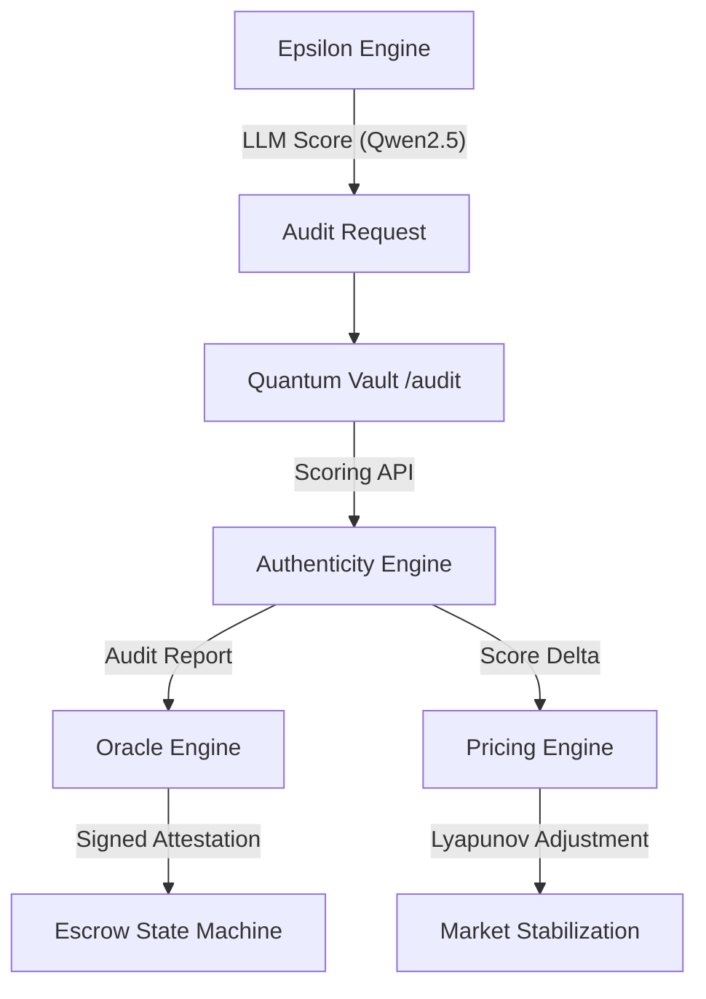

# AetherContracts Repository Status & Evolution Workflow

This document tracks the current state of the AetherContracts monorepo, highlighting recent changes and providing the unified development workflow.

---

## 1. Latest Git History (Traceability)

Tracked evolution of the unified platform:

*   **`ed358e1`** (HEAD): `chore: sync remaining changes`
*   **`84e5cf6`**: `feat(docker): embed Qwen2.5-0.5B for deterministic simulations`
    *   *Impact*: Ensures byte-identical inference across local and containerized environments.
*   **`bd5c123`**: `Initialize Axum backend API server for Authentication and Escrow execution`
    *   *Impact*: Core Rust API for processing audits and attestations.
*   **`281eba4`**: `Initialize Next.js dashboard, workflow, and agent skills`
    *   *Impact*: Interactive UI and agentic infrastructure.
*   **`b88b74f`**: `Initialize AetherContracts unified monorepo`
    *   *Impact*: Structural foundation.

---

## 2. In-Progress Deltas (Uncommitted)

Current architectural progress in the local environment:

### `aether-epsilon-engine` (Python)
- **Memory Flush**: Added `.flush()` to `ConversationMemory` in `backend/main.py` to prevent data loss on shutdown.
- **Boot Sequence**: Enhanced `boot()` with error recovery and automatic Clara Oracle crawling.
- **Entrypoint**: `v2/backend/main.py` is now the primary orchestrator.

### `aether-quantum-vault` (Rust)
- **Axum API**: Implemented `/health` and `/audit` endpoints in `main.rs`.
- **Oracle Engine**: `oracle.rs` now generates cryptographic attestations using SHA-256 for audit reports.
- **Lyapunov Pricing**: `pricing.rs` integrates the `GeometricGovernor` from `aether-core`.
    - Repurposes the kernel tick-rate control law for creator price stabilization.
    - Uses Lyapunov Energy $V = \frac{e^2}{2}$ to guarantee monotonic error reduction.

---

## 3. High-Level Data Flow



---

## 4. Operational Workflow

Follow these steps to build and verify the platform.

### Step 1: Rust Workspace Verification
Verify that the `Quantum Vault` and `Aether Core` crates compile.

```powershell
// turbo-all
cargo check --workspace
```

### Step 2: Epsilon Engine Boot
Start the v2 inference engine in a separate terminal.

```powershell
// turbo
python aether-epsilon-engine/engine/v2/backend/main.py --config config.yaml
```

### Step 3: Vault API Launch
Start the Axum backend for audits and attestations.

```powershell
// turbo
cd aether-quantum-vault
cargo run
```

### Step 4: Verification Suite
Run the formal verification tests for the Lyapunov pricing and Oracle logic.

```powershell
// turbo-all
cargo test -p aether-quantum-vault -- --nocapture
```

---

## 5. Maintenance & Sync
To sync the current local progress to the remote repository:

```powershell
git add .
git commit -m "feat: integrate Lyapunov pricing and Oracle attestations"
git push origin main
```
